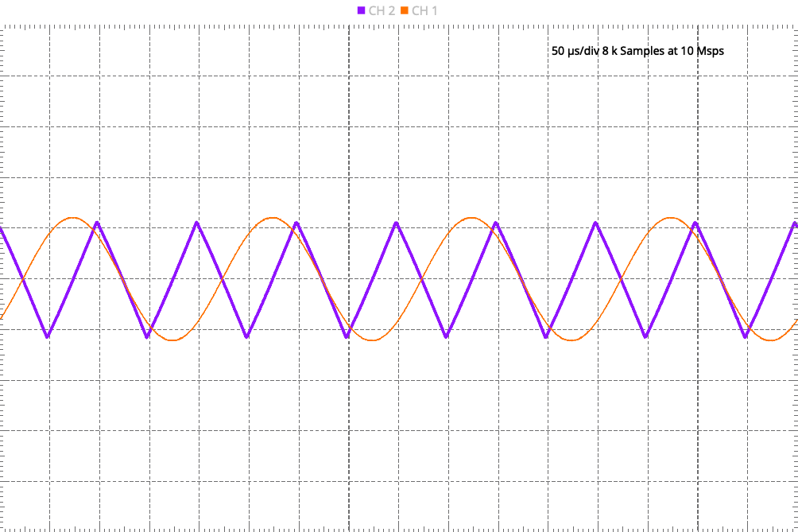

# Laboratory 6

In this laboratory, you will work with the ADALM2000 O-scope board, as well as working with interrupts on the NUCLEO-WB55 board.

## Experiment 1:  ADALM2000 Oscilloscope

Watch [this](https://www.youtube.com/watch?v=zWX7VnKDYq4&t=351s) video on the ADALM2000 Active Learning Module.  You will be using the signal generator and oscilloscope to create analog signals and watch them in the oscilloscope.  Watch the entire video, then follow along with the video with your ADALM2000.

Save an image of your oscilloscope screen by using the "Print" button and selecting PNG files.  You should end up with something like:

In STM32CubeIDE, create a new project for your STM32WB55 board called `oscope`.  Using one of the open GPIO pins, write code that generates a 3 kHz square wave (plus or minus 500 Hz is fine for accuracy).  Measure this square wave using the oscilloscope and Scopy software.  Print out a PNG of the oscilloscope showing the signal.  Detail how you set up the GPIO in your code (even if it comes preconfigured, make sure to detail this in your report.)

You are welcome to do this with a timer or in the main loop.  Describe and justify your design in your lab report.

## Experiment 2:  Interrupts

If you have not already done so, read Chapter 6 in Norris' *Programming with STM32*.  You will also read [this article](https://www.digikey.com/en/articles/how-to-implement-hardware-debounce-for-switches-and-relays) on hardware debouncing for switches.  Finally, read [this article](https://digilent.com/reference/learn/microprocessor/tutorials/debouncing-via-rc-filter/start) on using a simple R-C lowpass filter for debouncing.

For this experiment, you will wire up a momentary switch to your breadboard and debounce it using a 10 kOhm resister and a 0.1 uF capacitor.  This is a smaller cap than what is in the article, but should be fine for this application.  Use the oscilloscope to show the bounce on the momentary switch and then the debounce at the output of the lowpass filter.  Put both curves on the same plot.  Include the plot in your lab report.

Next, wire up the LED from your kit with a 220 Ohm resister.  Test the circuit to make sure the LED lights up.

Assign the switch to an open GPIO port.  Do the same for the LED.  Draw the circuit neatly, label it completely, and include it in your lab report.

Now, write code--using interrupts--so that the LED blinks at 2 Hz.  When a user presses the momentary switch, the LED will then blink at 1 Hz.  Another press puts the LED frequency back to 2 Hz.  And so on.  You may refer to the code in the text, *but not copy from it.*

Remember to set up the GPIO ports for the LED and the switch.  You may want to test them before trying to set up the interrupt.

The well-written lab report will describe the procedure and design concisely but completely.  It will also contain photographs of the set up and link to a video of the blinking.